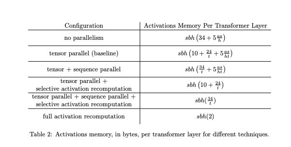

## 摘要


## 1.GPU显存按页分配
### 1.1 CUDA上下文
&emsp;&emsp;在正式开始分析如何评估模型在GPU上的占用分析之前，我们需要先了解GPU的一些显存分配方式
&emsp;&emsp;我们可以使用`nvidia-smi`命令查看GPU的显存使用情况，其GPU显存使用 = CUDA context + pytorch
&emsp;&emsp;CUDA context是GPU上的一个进程，其占用的显存是固定的，不会随着模型的变化而变化，而pytorch占用的显存是随着模型的变化而变化的。CUDA context 是是在第一次执行CUDA操作，也就是使用GPU的时候所需要创建的维护设备间工作的一些相关信息，占用的大小和 CUDA 版本、硬件设备有关。
&emsp;&emsp;可以用`torch.tensor([1.0]).to('cuda')`后查看显存占用情况即可得到CUDA context占用的显存大小。
### 1.2 GPU显存按页分配
&emsp;&emsp;在pytorch的显存分配中，其是按页来分配的。具体来说，就算我们只想要申请一个很小的显存空间，pytorch也会向CUDA设备申请更大的显存到自己的cache，再由pytorch的分配器来分配给我们。这样做的好处是可以减少向CUDA设备申请显存的次数，从而提高效率。
&emsp;&emsp;关于其分配器的分配逻辑，我们可以点击[这里](https://github.com/pytorch/pytorch/blob/main/c10/cuda/CUDACachingAllocator.cpp)查看源码以及分配方式。
或者查看[官方文档](https://pytorch.org/docs/stable/notes/cuda.html#cuda-memory-management)。

<center>
    
    <br>
    <div style="color:orange; border-bottom: 1px solid #d9d9d9;
    display: inline-block;
    color: #999;
    padding: 2px;">PyTorch hierarchical memory management</div>
</center>

&emsp;&emsp;我们可以用下面一些指令来进行pytorch显存的查看与管理
- torch.cuda.memory_allocated() 可以看到当前Tensor占用的显存
- torch.cuda.memory_reserved() 可以看到总共占用的显存
- torch.cuda.empty_cache() 清空未使用的缓存，但是已经使用的是不能释放的
- torch.cuda.max_memory_allocated() 调用函数为止所达到的最大的显存占用字节数

&emsp;&emsp;下面举一些例子，当我们想要向pytorch申请一个4b的空间时，pytorch会先向CUDA申请一个2MB的空间，然后pytorch会给我们分配512b的空间。当我们再次向pytorch申请一个4b的空间时，pytorch会直接直接利用这512b对空间，而不会再向CUDA申请空间。
&emsp;&emsp;同时，如果数据规模变大，pytorch会向CUDA申请更大的空间，然后再分配给我们。而在实际中大型的模型中，这些空间的分配往往也会变得很大。
### 1.3 其他查看显存的方法
或者使用 pynvml 库 来查看
- nvmlDeviceGetHandleByIndex() 获取Nvidia GPU块数
- nvmlDeviceGetMemoryInfo() 获取GPU i的handle，后续通过handle来处理
- nvmlDeviceGetMemoryInfo() 通过handle获取GPU 的信息

&emsp;&emsp;需要注意的是，当第一次向gpu写入信息时，也需要加载kernal从而占用一部分GPU，在后续的计算中，我们可以通过减去这部分占用来得到模型本身的显存占用。


## 2.模型在单个GPU上的内存消耗计算

### 2.1内存消耗的计算
&emsp;&emsp;模型在GPU上的内存占用需要分两种情况，如果是进行模型的训练，则模型显存占用 = 模型参数大小 + 输入数据集大小 + 输出以及中间缓存数据大小 + 优化器数据大小，而在反向传播阶段，则需要存放梯度大小，但是会释放掉中间缓存的数据大小；如果是进行模型的推断，则模型显存占用大小 = 模型参数大小 + 输入数据集大小 + 输出数据集大小
&emsp;&emsp;下面将会对这些数据进行详细的分析，并使用一些经典的模型为例

### 2.2 训练阶段内存占用
#### 2.21 模型参数大小
&emsp;&emsp;目前模型的参数绝大多数都是float32类型, 占用4个字节，所以计算模型参数大小一个最简单的方法就是用模型参数数\*4即可得到模型参数大小。也有一些模型参数采用混合精度，这部分占用显存为模型参数\*6(在内存中同时维护一个 fp32 和一个 fp16 的模型)
&emsp;&emsp;占用显存的层一般是：
- 卷积层，通常的conv2d
- 全连接层，也就是Linear层
- BatchNorm层
- Embedding层
- 注意力层
  
&emsp;&emsp;而不占用显存的则是：

- 激活层Relu等
- 池化层
- Dropout层
  
&emsp;&emsp;具体计算方式(如果有bias需要加上)：

- Conv2d(Cin, Cout, K): 参数数目：Cin × Cout × K × K
- Linear(M->N): 参数数目：M×N+N(bias)
- BatchNorm(N): 参数数目： 2N
- Embedding(N,W): 参数数目： N × W

&emsp;&emsp;通过上面的方法，我们可以大概计算出模型的参数，当然，我们也可以用`torchinfo`库来查看模型有多少参数，比直接print(model)的信息更全，可视化效果更好。

&emsp;&emsp;在分析经典的模型之前，我们先将目光投在简单的模型。定义一个基础的变换模型,模型结构如下，我们在后面的分析中都会使用这个模型作为例子。


<center>
    
    <br>
    <div style="color:orange; border-bottom: 1px solid #d9d9d9;
    display: inline-block;
    color: #999;
    padding: 2px;">simple module</div>
</center>

&emsp;&emsp;计算模型参数大小:4\*(1024\*1024+1024\*1024+1024\*2048)/1024/1024 + 4*(1024+1024+2048)/1024/1024 = 16.015625MB,与程序输出结果一致


#### 2.22 输入数据集大小
&emsp;&emsp;对于模型的训练，我们还需要将输入数据集也放入显存中，每个输入数据通常是FP32类型，占用4个字节，所以数据集大小 = 数据个数 * 4
&emsp;&emsp;为了方便计算，我们设输入数据集为torch.zeros(10240,1024),即40MB,与程序输出结果一致
&emsp;&emsp;对于输入labels，也需要计算在内
&emsp;&emsp;事实上，输入数据集的batchSize以及sentenceLength有时候会因为不同的算子对后续中间缓存数据造成不同的影响，我们将会在后文中强调说明算子的重要性
#### 2.23 输出、中间缓存数据大小
&emsp;&emsp;通常来说，一个模型训练过程中显存最大的占用即是输出和中间缓存数据大小，因为需要在梯度计算时需要用到其中间激活值，故需要保存这些数据
&emsp;&emsp;中间数据的保留根据不同算子保留的大小也不同，例如`y = self.net_a(x) z = self.net_b(y)`中x、y、z都需要保留，而`z = self.net_b(selt.net_a(x))`中只需要保留下x、z即可
&emsp;&emsp;而激活层来说有时其实并不需要保存数据，举个例子`y=relu(x) -> dx = dy.copy();dx[y<=0]=0`
&emsp;&emsp;一个比较简单的算法是计算每个层的输出后相加，然后去掉不需要保留的数据大小.同样适用我们上面的模型，在刚才的输入下，我们需要保留的输出以及中间缓存数据大小为:

<center>4*(10240*1024+10240*1024+10240*2048*)/1024/1024 = 160MB</center>

&emsp;&emsp;程序输出168.125MB，是因为计算过程中产生了一些中间变量和一些必要缓存数据，程序按页分配内存，最后中间变量被清除，故而多余了8.125MB的显存占用（这8.125MB在不同显卡下情况也不同，有的甚至没有），如果此时再次用模型验证，可以得到160MB显存占用的正确结果显示

&emsp;&emsp;事实上，[这篇论文](https://arxiv.org/pdf/2205.05198.pdf)中详细阐述了activations的计算过程，并且提出了几种优化方案，下图截取自论文的一部分

<center>
    
    <br>
</center>

#### 2.24 反向传播与梯度计算
&emsp;&emsp;首先我们先计算loss，loss的计算过程中需要用到模型的输出，故而需要保留模型输出，在我们的模型中直接用sum来计算loss，此时loss占用应该是4字节，但是因为显存按页分配，所以额外分配了512字节
&emsp;&emsp;在这个阶段，模型实际占用 = 模型参数大小 + 梯度大小 + 输入 + 输出+loss，其中在一般情况下梯度大小等于4*参数数量，参数数量包括混合精度（梯度总是以fp32来保存）。中间激活变量的数据会在梯度计算后当计时器归为0后被清除释放，值得注意的是，这个阶段同样会有额外的8.125MB显存占用，来源于第一次进行反向传播时的一些必要缓存数据（同前向传播一样），当再次反向传播时即不会多出8.125MB的显存占用
&emsp;&emsp;在我们的模型例子中，最后的显存占用应该为：

<center>16.015625 + 16.015625 + 40 + 80 + 8.125*2 + = 168.28173828125 </center>
&emsp;&emsp;与程序输出结果一致

&emsp;&emsp;值得注意的是，此时模型的显存占用并不是最大的，最大的显存占用应该是在其中梯度计算的过程中，此时需要保存所有出现过的数据，并计算额外的中间激活变量（例如原本的激活层），同时还有各种临时变量，即模型参数大小 + 梯度大小 + 输入 + 输出+loss + 中间激活变量 + 临时变量，此时显存占用为360.2744140625MB，这个显存再加上优化器参数占用缓存就是在不会发生显存溢出的情况下训练程序所需要的最小显存

#### 2.25 优化器参数大小
&emsp;&emsp;不同的优化器需要保存不同的参数大小，总体与模型参数大小有关
- 如果你采用AdamW，每个参数需要占用8个字节，因为需要维护两个状态。也就说优化器使用显存是全精度(float32)模型权重的2倍。
- 如果采用bitsandbytes优化的AdamW，每个参数需要占用2个字节，也就是全精度(float32)模型权重的一半。
- 如果采用SGD，则优化器占用显存和全精度模型权重一样。

&emsp;&emsp;优化器参数占用显存是在第一次调用`step()`后，之后再次使用降不会额外多占用显存
&emsp;&emsp;这里我们使用AdamW为例子，模型参数大小16.015625MB，优化器参数大小为32.03125MB，与程序输出结果一致

#### 2.26 特殊内存要求
&emsp;&emsp;一些特殊的模型需要额外的显存空间，例如当使用beam search时模型需要保留多份输入和输出

### 2.3 推断阶段内存占用
&emsp;&emsp;在推断阶段，由于我们不需要计算梯度大小，故而不需要保存中间的激活变量。
&emsp;&emsp;此时模型的显存占用=模型参数大小 + 输入 + 输出 + 初始化，即16.015625 + 40 + 80 + 8.125= 144.140625MB

### 2.4 以bert模型为例
#### 2.41 训练阶段
&emsp;&emsp;我们使用的bert是huggingface中的bert-base-uncased，参数量为110M,所有参数类型为FP32，优化器使用AdamW。按上面分析的结果，显存占用量应该为模型参数+输入+输出以及中间激活量。输入为`torch.zeros((32,512),dtype=torch.long)`。
&emsp;&emsp;可以看到显存占用数据：
- 模型参数占用： 418.7295 MB
- 输入占用：0.125MB
- 输出及中间变量: 13931.34375 MB （输出 48MB）
- 方向传播后占用：903.5874MB
- 优化器参数大小：841.0273MB

&emsp;&emsp;与之前分析结果一致
#### 2.42 推测阶段
&emsp;&emsp;同样使用刚才的bert模型，输入也一致，按照上面的分析，推测阶段显存占用为模型参数大小 + 输入 + 输出 + 初始化
&emsp;&emsp;可以看到显存占用：
- 模型参数占用： 418.7295 MB
- 输入占用：0.125MB
- 输出以及初始化占用：56.21875MB

#### 2.43 batchSize对显存的影响
&emsp;&emsp;通过刚才的分析，模型占用显存主要是来源于中间激活变量，而中间激活变量通常与batchSize成正比的关系
&emsp;&emsp;实际上，batchSize对提高模型效率有着重要的关系，取什么batchSize取决于特定的硬件和模型的数据类型，这个数字通常是从8开始的，但也可能更高。我们可以阅读NVIDIA的文档，关于输入/输出神经元数量和批量大小的建议。而不同的数据类型由于定义的乘法器也不同，故推荐的batchSize也不同，比如基础的华莱士树乘法器。对于fp16，建议使用8的倍数，但在A100上却是64。
&emsp;&emsp;下面我们来简单测试batchSize对bert模型的显存占用的影响

<center>
    
    <br>
    <div style="color:orange; border-bottom: 1px solid #d9d9d9;
    display: inline-block;
    color: #999;
    padding: 2px;">The influence of batchsize</div>
</center>

&emsp;&emsp;可以知道，显存占用和batchSize是O(n)的关系，事实上，对于绝大多数模型来说batchSize都是O(n)的关系

#### 2.44 sentenceLength对显存的影响
&emsp;&emsp;sentenceLength对显存的影响主要体现在对中间激活变量activations的影响，有的是O(n)的关系，而有的是O(n^2)的关系，主要取决于选取算子的影响。不同算子对计算会有不同需要保存的数据，这部分我们在后文中进行详细分析。而对于bert模型来说，其输入文本长度与显存占用是O(n^2)的关系，这也是为什么bert很难适应于长文本对原因
&emsp;&emsp;我们定义一个最大长度能够支持2560的bert模型，令输入的batchSize为1,简单测试sentence Length对其显存占用的影响

<center>
    
    <br>
    <div style="color:orange; border-bottom: 1px solid #d9d9d9;
    display: inline-block;
    color: #999;
    padding: 2px;">The influence of sentenceLength</div>
</center>

&emsp;&emsp;我们再对其进行拟合，可以得到拟合直线`0.00123 x^2 + 0.6039 x + 437.9`符合预期
&emsp;&emsp;图中的数据仅仅在batch为1的情况下进行单词传播统计的，充分表明了bert模型以及其变种的局限性

## 3.pytorch算子对GPU内存占用的影响
### 3.1算子如何影响内存占用
&emsp;&emsp;在PyTorch中，Operator通常指的是Tensor操作，它们是构成神经网络模型的基本构建块。
1. 狭义的算子（Kernel）。对Tensor执行的基本操作集合，包括四则运算，数学函数，甚至是对Tensor元数据的修改，如维度压缩（squeeze），维度修改（reshape）等
2. 广义的算子（Function）。PyTorch中算子模块的具体实现，涉及到调度模块，Kernel模块，求导模块以及代码自动生成模块。

&emsp;&emsp;这些算子允许在张量上进行各种数学操作，一些常见的算子包括:
- 算术运算符:+,-,*,/等
- 激活函数:ReLU, Sigmoid, Tanh等
- 池化操作:MaxPool, AvgPool等
- 卷积操作:Conv1d, Conv2d, Conv3d等
- 归一化:BatchNorm1d, BatchNorm2d, LayerNorm等
- 损失函数:CrossEntropyLoss, MSELoss, NLLLoss等
- 线性层:Linear
- 循环神经网络:RNN, LSTM, GRU等
  
&emsp;&emsp;不同的算子实现过程是不同的计算图，故需要保存的中间激活变量不同，从而对显存占用也不同，同时不同的算子的效率也天差地别，我们希望通过讲解几个算子的例子来说明高效的算子对模型的重要性

### 3.2传统Attention与FlushAttention
&emsp;&emsp;例如MLP块，看MLP块的中间激活，假设中间变量使用fp32来保存(4字节),其计算公式如下
$$x = f_{gelu}(xW_1)W_2+x_{out}$$
1. x的形状为[b,s,h],第一个线性层，保存其输入，为4bsh
2. 激活函数保存其输入,占用


## 4 优化方法
#### 4.1 梯度累积
&emsp;&emsp;梯度累积是一种训练神经网络的数据Sample样本按Batch拆分为几个小Batch的方式，然后按顺序计算，按照我们之前的分析，通常拆分为1个Batch最节省显存。
&emsp;&emsp;在进一步讨论梯度累积之前，我们再回头来看看神经网络的计算过程。我们最终是需要通过损失函数来计算每个样本的损失值，通过反向传播，计算损失值对于模型参数的梯度，最后利用梯度来更新模型的参数。
&emsp;&emsp;优化器用于对网络模型模型权重参数更新的数学公式。以一个简单随机梯度下降(SGD)算法为例。
&emsp;&emsp;假设Loss Function函数公式为：
$$Loss(\theta)=1/2(h(x^k)-y^k)$$
&emsp;&emsp;在构建模型时，优化器用于计算最小化损失的算法。这里SGD算法利用Loss函数来更新权重参数公式为
$$\theta_i=\theta_{i-1}-lr*grad_i$$
&emsp;&emsp;其中theta是网络模型中的可训练参数（权重或偏差），lr是学习率，grad是相对于网络模型参数的损失。
&emsp;&emsp;梯度累积则是只计算神经网络模型，但是并不及时更新网络模型的参数，同时在计算的时候累积计算时候得到的梯度信息，最后统一使用累积的梯度来对参数进行更新。
$$acc=\sum_{i = 0}^n{grad_i}$$
&emsp;&emsp;在不更新模型变量的时候，实际上是把原来的数据Batch分成几个小的更小的batch，每个step中使用的样本实际上是更小的数据集，从而减少单次传播过程占用的显存。
&emsp;&emsp;在N个step内不更新变量，使所有更小的Batch都使用相同的模型变量来计算梯度，以确保计算出来得到相同的梯度和权重信息，实际上等价于使用原来没有切分的Batch size大小一样。即：
$$\theta_i=\theta_{i-1}-lr*\sum_{i = 0}^n{grad_i}$$
&emsp;&emsp;实际上最终的结果和之前的做法是一样的，但是这样可能会减慢模型的训练速度，不利于并行化计算。

<center>
    
    <br>
    <div style="color:orange; border-bottom: 1px solid #d9d9d9;
    display: inline-block;
    color: #999;
    padding: 2px;">Gradient_Accumulation</div>
</center>

&emsp;&emsp;我们在这里先分析伪代码：
```
#正常训练
for i, (images, labels) in enumerate(train_data):
    outputs = model(images)
    loss = criterion(outputs, labels)

    optimizer.zero_grad()
    loss.backward()
    optimizer.step()
```
&emsp;&emsp;正常训练是每次输入一个batch的数据，我们就要更新一次梯度，更新一次参数
```
# 梯度累加参数
# 若要达到和之前一样的训练效果，该值要设定为与当前的batch_size相乘等于原来的batch_size
accumulation_steps = 4
loss = 0

for i, (images, labels) in enumerate(train_data):
    outputs = model(imgaes)
    loss_now = criterion(outputs, labels)

    # loss_now regularization
    loss += loss_now / accumulation_steps

    loss.backward()

    # update parameters of net
    if ((i+1) % accumulation)==0:
        optimizer.step()
        optimizer.zero_grad()
        loss = 0
```
&emsp;&emsp;梯度累积就是每次获取1个batch的数据，计算1次梯度，此时梯度不清空，不断累积，累积一定次数后，根据累积的梯度更新网络参数，然后清空所有梯度信息，进行下一次循环。
&emsp;&emsp;实际上使用huggingface提供的库函数来快速对比使用了梯度累积和未使用的效果差别，输入数据总大小为512个句子，每个句子长度512
&emsp;&emsp;默认训练下batchSize为4，由程序，训练整个程序需要的显存为11539 MB，训练时间为170.19s，Samples/second为3.01
&emsp;&emsp;接下来我们使用梯度累积优化，accumulation_steps=4，batchSize = 1，使得两个训练得到相同的效果，最终训练整个程序需要的显存为7343 MB，训练时间为190.22s，Samples/second为2.69
&emsp;&emsp;我们可以看到通过使用梯度累积极大的节省了显存空间，代价仅仅是稍微减慢了一些训练的速度和时间。为了让我们的GPU得到充分的使用，我们可以动态地设置这些参数，使得模型在有限的显存空间下达到最快的训练速度

#### 4.2 梯度检查点
&emsp;&emsp;为了方便在反向传播的过程中计算梯度，我们通常会保存正向传播中的所有激活值，也就是前面提到的中间激活变量，这可能会导致显存的开销变得很大。当然，我们也可以极端的在正向传播中忘记掉所有的中间激活变量，当反向传播需要使用时，重新计算一遍。但是这种做法计算开销太大，会极慢的减慢训练速度。
&emsp;&emsp;梯度检查点就是其中折中的办法，选则性的在计算图中保存中间激活值，对于没有保存的激活值，只需要利用最近保存的来重新计算即可获得梯度。
&emsp;&emsp;梯度检查点首次发表在2016年的论文[《Training Deep Nets With Sublinear Memory Cost》](https://arxiv.org/pdf/1604.06174.pdf)中。论文声称提出的梯度检查点算法将模型的动态内存开销从$O(n)$（n为模型中的层数）降低到 $O(\sqrt{n})$，并通过实验展示了将 ImageNet 的一个变种从 48GB 压缩到了 7GB 内存占用。

<center>
    
    <br>
    <div style="color:orange; border-bottom: 1px solid #d9d9d9;
    display: inline-block;
    color: #999;
    padding: 2px;">a process of Gradient_Checkpointing</div>
</center>

&emsp;&emsp;同样的，我们使用梯度检查点来优化我们的模型//TODO

#### 4.3 FP16
&emsp;&emsp;还有一种优化的方法：混合精度训练
&emsp;&emsp;混合精度训练主要思想是并非所有的数据都需要使用FP32来保存，如果我们能够减少这些变量的精度，可以提高训练速度，同时减少显存占用
&emsp;&emsp;下面是一些常用的参数类型：
- fp32 (float32)
- fp16 (float16)
- bf16 (bfloat16)
- tf32 (CUDA internal data type)

<center>
    
    <br>
    <div style="color:orange; border-bottom: 1px solid #d9d9d9;
    display: inline-block;
    color: #999;
    padding: 2px;">Common parameter types</div>
</center>

&emsp;&emsp;bf16和tf32只在一些特定的硬件支持下才能使用，fp32和fp16是我们常用的参数类型，fp16的优点是占用的显存更少，但是精度更低，容易出现梯度爆炸或者梯度消失的问题，fp32的优点是精度更高，但是占用的显存更多，训练速度更慢。
&emsp;&emsp;这里的混合精度训练指代的是单精度 float和半精度 float16 混合。比较经典的就是这篇ICLR2018，百度和Nvidia联合推出的论文 [MIXED PRECISION TRAINING](https://arxiv.org/pdf/1710.03740.pdf)。
&emsp;&emsp;尽管fp16有很多好处，但是不能所有的参数都使用fp16，其可能导致如下问题
1. 数据溢出问题
2. 舍入误差

&emsp;&emsp;这里不过多分析，详见论文。当然，其也提供了几种解决方法：
1. FP32 权重备份：用来解决舍入误差
2. Loss Scale：解决underflow 
3. 提高算数精度：利用fp16进行乘法和存储，利用fp32来进行加法计算

&emsp;&emsp;接下来，我们试着用混合精度计算来优化我们的模型 //TODO

#### 4.4 优化器改进
&emsp;&emsp;前面提到过，不同的优化器会占用不同的显存，那么我们也可以通过更换占用显存更低的优化器来降低显存占用。
//TODO
&emsp;&emsp;最常见的Adam 或者 AdamW
&emsp;&emsp;Adafactor
&emsp;&emsp;8-bit Adam


## 5.多GPU训练内存分配
### 5.1 DataParallel 
&emsp;&emsp;数据并行是最常用的并行训练方式，主要分为DataParallel(DP)和DistributedDataParallel(DDP)，DP因为负载严重不均衡基本上已经被更优秀的DDP方式取代
&emsp;&emsp;二者主要的行为不同在于：
- DP （单进程多线程）
   - 对于每一个batch,DP会有如下行为:
        1. GPU 0将数据分发到其他GPU 
        2. GPU 0将最新训练好的模型发到其他GPU 
        3. 前向传播，每个GPU 将loss发到GPU 0，然后GPU 0计算损失
        4. 将GPU 0上计算完的损失传输到所有GPU上，进行反向传播。
        5. 每个GPU将计算出的梯度发到GPU 0，随后GPU0计算平均损失
- DDP（多进程）
    - 在开始的时候，主进程将模型从gpu 0复制到其他gpu上
    - 对于每一个batch,DDP会有如下行为:
        1. 每一个GPU直接利用自己的模型参数计算自己的小batch，拥有自己的optimizer
        2. 在反向传播的过程中，所有GPU计算得到梯度之后会通过通信后端进行通信，ring all-reduce的方式每个GPU都会得到其他所有GPU的参数梯度，最终平均更新

&emsp;&emsp;实际上，二者本质都在于增大batchSize来提高运行速度和最大化使用显存，针对DP来说，Dataloder的batch_size是针对所有卡训练batch_size的和，例如10卡，每张卡batch_size是20，那么就要指定batch_size为200。针对DDP来说，batch_size就是一张卡所训练使用的batch_size的值。
&emsp;&emsp;通常来说DDP要优于DP，但是在一些特殊情况下，DP也有其优势，例如：
- DP没有python线程的限制，例如GIL
- 若GPU卡之间交互慢可能导致DDP速度变得很慢

#### 5.11 DP详解
&emsp;&emsp;DP实现较为简单，可以通过`torch.nn.DataParallel()`来调用，我们对Bert模型进行训练测试
//TODO:分析测试结果
#### 5.12 DDP详解
&emsp;&emsp;我们先分析一下DDP的伪代码:
//TODO
### 5.2 ZeRO Data Parallelism
&emsp;&emsp;ZeRO Data Parallelism很像传统的DP，但不同的是其不是复制完整的模型参数、梯度和优化器状态，而是每个GPU只存储其中的一部分。然后，在运行时，当需要完整的层参数时，所有的GPU都会同步，互相提供彼此缺失的部分
&emsp;&emsp;举一个例子,我们有如下的一个模型,总共有三层，每层有三个参数

<center>
    
    <br>
</center>

&emsp;&emsp;若我们有三个GPU，那么我们可以将模型参数分配如下：

<center>
    
    <br>
</center>

&emsp;&emsp;每个GPU像DP一样，常规的获得batch，此时在La层，GPU0需要参数a0，a1，a2，但它自己只有参数a0，则GPU1和GPU2会分别将a1和a2发送给GPU0，从而获得完整的参数，这样的行为同样对GPU1和GPU2也是适用的。
&emsp;&emsp;三个GPU都获得了完整对参数，随后继续前向传播，最后反向传播也是同理，这就是整个ZERO DP的过程

### 5.3 TensorParallel (TP)
&emsp;&emsp;Tensor并行，把一整个tensor分成多份，每份被分配在指定的GPU上，在这个过程中，每份单独在不同的gpu上单独的运行，并最终同步结果。
&emsp;&emsp;简单的矩阵乘法可以很清晰的看到这个过程，下面的图片展示如何将一个矩阵乘法分在两个GPU上运行，每个GPU只负责一部分，可以以行或以列的方式进行，当然，二者因为储存顺序的原因速度也会不同，我们建议以行来进行划分，因为这样可以减少通信的次数，从而提高速度。

<center>
    
    <br>
</center>

&emsp;&emsp;我们可以将其应用在传统的MLP层中，或者是multi-headed attention中，对于后者，多个head之间本身就是并行计算的，更加方便
&emsp;&emsp;需要注意的是，TP这种方法需要特别快速的网络交互

### 5.4 PipelineParallel (PP)
#### 5.41 MP
#### 5.42 PP

## 6.谈到RetNet

